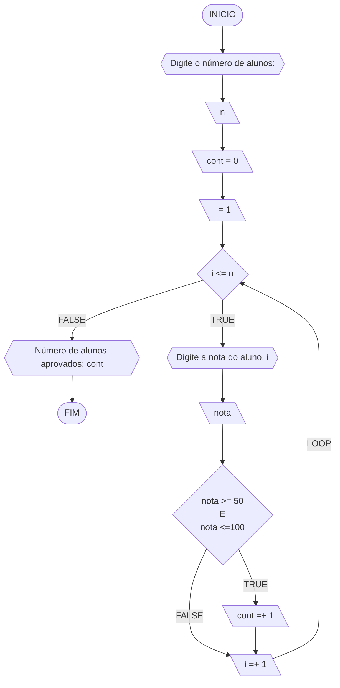
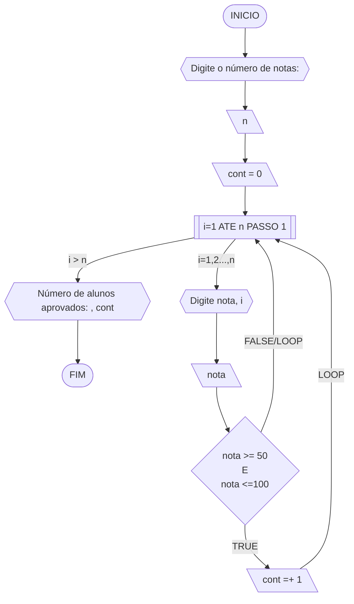
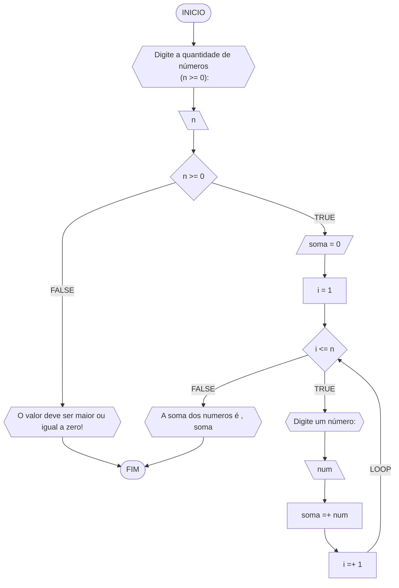
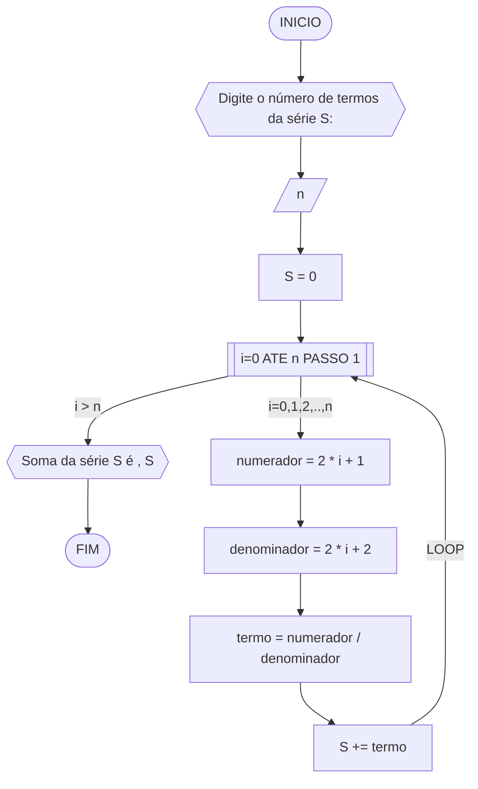
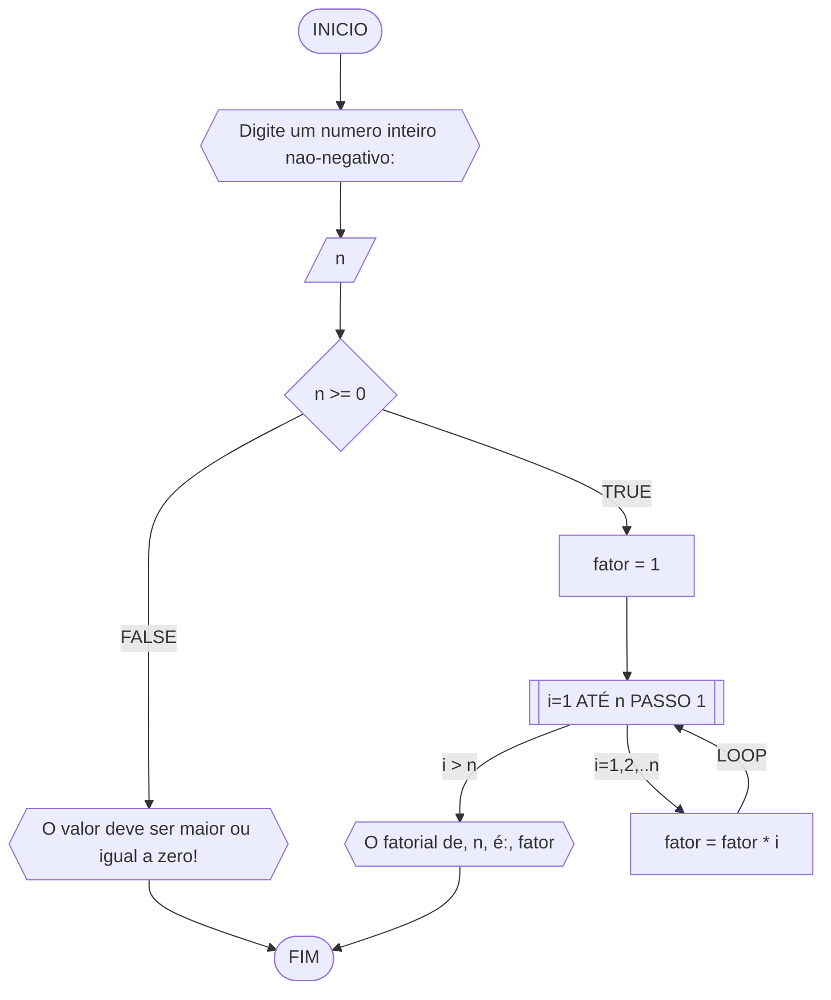
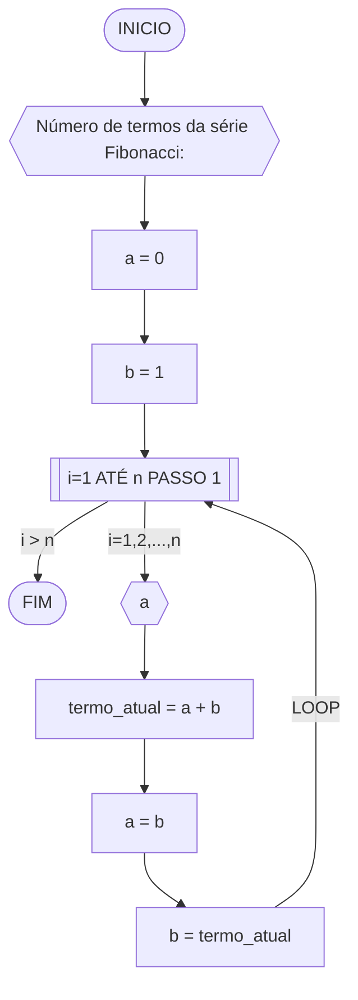
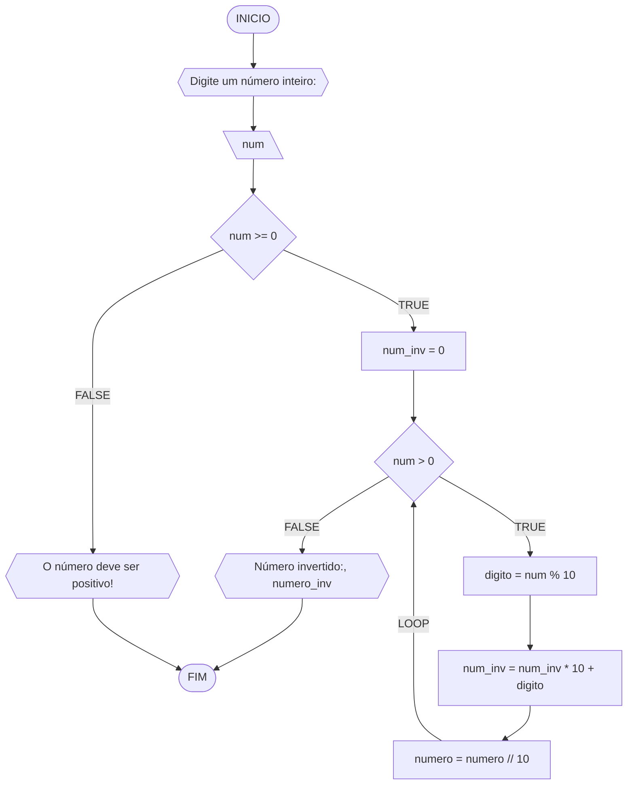

Curso: analise e desenvolvimento de sistema
Disciplina: raciocinio logico
Código/Turma:T160-80
Professor: Ricardo Carubbi
Data: 21/04/24
Aluno(a):marjorie castelo dos santos
Matrícula: preencha com seus dados

1a chamada (Sim/Não): sim
2a chamada (Sim/Não):nao

## Lista de questões

### Questão 1 - Troca dos valores de duas variáveis (1 ponto)

Dadas duas variáveis, $a$ e $b$, implemente e teste um algoritmo para trocar os valores atribuídos a elas.

#### Descrição geral do algoritmo

1. Guardar o valor original da variável $a$ em uma variável auxiliar $aux$;
2. Atribuir à variável $a$ o valor original da variável $b$;
3. Atribuir à variável $b$ o valor original da variável $a$, que está armazenado na variável auxiliar $aux$.
4. Exibir os novos valores de $a$ e $b$.

#### Fluxograma


#### Pseudocódigo (1 ponto)

```
Algoritmo TrocaValores
INICIO
...
1.algoritmo definir_variaveis{Definir variáveis a e b}
2.definir_variaveis --> atribuir_valores{Atribuir valores iniciais a e b}
3. atribuir_valores --> guardar_original{Guardar valor original de a em auxiliar}
4.guardar_original --> atribuir_a{Atribuir valor original de b a a}
5. atribuir_a --> atribuir_b{Atribuir valor original de a (guardado em auxiliar) a b}
6.  ALGORITIMO atribuir_b --> mostrar_novos_valores((Exibir novos valores de a e b))
7. FIM_SE
FIM
```

#### Teste de mesa

| a  | b  | aux | a  | b  | saída 1 | saída 2 | 
| -- | -- | --  | -- | -- | --      | --      | 
| 0  | 1  | 0   | 1  | 0  | a = 1   | b = 0   |

### Questão 2 - Contagem (1 ponto)

Dado um conjunto $n$ de notas de alunos em um exame, implemente e teste um algoritmo para fazer uma contagem $cont$ do número de alunos que foram aprovados no exame. 
Será considerado aprovado o aluno que tirar $nota$ 50 ou maior (no intervalo de 0 a 100).

#### Descrição geral do algoritmo

1. Obter o número de notas $n$ a serem processadas;
2. Inicializar a contagem $cont$ com zero;
3. Enquanto houver notas a serem processadas, fazer repetidamente:
    - obter a próxima nota;
    - se a nota for suficiente para passar no exame ($n ≥ 50$) então adicionar 1 (um) à contagem $cont$;
4. Exibir a contagem $cont$ (número total de aprovações).

#### Fluxograma 01
Fluxograma conforme descrição do algoritmo acima, usando o loop ENQUANTO.



#### Fluxograma 02
Fluxograma opcional usando o loop PARA.



#### Pseudocódigo 01 (1 ponto)

```
Algoritmo ContaAprovacoes
INICIO
...
1. print("Digite o número de alunos: ")
2. n = int(input())  # número de alunos
3. cont = 0  # contador de alunos aprovados
4. i = 1  # contador para iterar sobre os alunos
//enquanto i for menor ou igual a n
5. while i <= n:
// Digite a nota do aluno i
6.print("Digite a nota do aluno", i, ":")
7.nota = float(input())
//Se a nota estiver entre 50 e 100 (inclusive)
8.if nota >= 50 and nota <= 100:
9.cont += 1  # Incrementa o contador de alunos aprovados
10.i += 1  # Incrementa o contador de alunos
//Número de alunos aprovados
11.print("Número de alunos aprovados:", cont)
FIM
```

#### Teste de mesa 01
Teste de mesa referente ao algoritmo usando o loop ENQUANTO.

| it | n  | i  | cont | i<=n  | nota, i | nota | nota_valida | cont+1 | i+1 | saída        | 
| -- | -- | -- | --   | --    | --      | --   | --          | --     | --  | --           |
| 1  | 3  | 1  |  0   | True  | nota 1  | 60   | True        | 1      | 2   |              |
| 2  | 3  | 2  |  1   | True  | nota 2  | 40   | False       | 1      | 3   |              |
| 3  | 3  | 3  |  1   | True  | nota 3  | 90   | True        | 2      | 4   |              |
| 4  | 3  | 4  |  2   | False |         |      |             |        |     | Aprovados: 2 |

#### Teste de mesa 02
Teste de mesa referente ao algoritmo usando o loop PARA.

| it | n  | cont | i  | nota, i | nota | nota_valida | cont+1 | saída        | 
| -- | -- | --   | -- | --      | --   | --          | --     | --           |
| 1  | 3  | 0    | 1  | nota 1  | 60   | True        | 1      |              |
| 2  | 3  | 1    | 2  | nota 2  | 40   | False       | 1      |              |
| 3  | 3  | 1    | 3  | nota 3  | 90   | True        | 2      | Aprovados: 2 |

### Questão 3 - Soma de um conjunto de números (1 ponto)

Dado um conjunto de $n$ números, implemente e teste um algoritmo para calcular a soma desses números. <br>
Aceite apenas $n$ maior ou igual a zero.

#### Descrição geral do algoritmo

1. Obter a quantidade de números $n$ a serem somados.
2. Inicializar a variável $soma$ com 0 (zero).
3. Enquanto menos do que $n$ números tiverem sido somados, fazer repetidamente:
    - obter o próximo número $i$;
    - calcular a soma atual, adicionando o número $i$ obtido à soma mais recente;
4. Exibir a soma dos $n$ números

#### Fluxograma



#### Pseudocódigo (1 ponto)

```
Algoritmo SomaNumeros
INICIO
...
1.print("Digite o número de termos da série S: ")
2.n = int(input())  # número de termos da série
3.S = 0  # inicializa a série S com zero
   // Loop para cada termo da série
4.for i in range(n + 1):
5.numerador = 2 * i + 1
6.denominador = 2 * i + 2
7.termo = numerador / denominador
8.S += termo
  //Soma da série S
9.print("Soma da série S é", S)
FIM
```

#### Teste de mesa

| it | n  | n >= 0 | soma | i  | i <= n | num | soma =+ num  | saída                   |
| -- | -- | --     | --   | -- | --     | --  | --           | --                      |
|    | -3 | False  |      |    |        |     |              | O valor deve ser ...    |
| 1  | 0  | True   | 0    | 1  | False  |     |              | A soma dos números é 0  |
| 1  | 3  | True   | 0    | 1  | True   | 5   | 0 + 5 = 5    |                         |
| 2  | 3  | True   | 5    | 2  | True   | 10  | 5 + 10 = 15  |                         |
| 3  | 3  | True   | 15   | 3  | True   | 20  | 15 + 20 = 35 |                         |
| 4  | 3  | True   | 35   | 4  | False  |     |              | A soma dos números é 35 |

### Questão 4 - Cálculo de uma série (1 ponto)

Dado um conjunto de $n$ termos da série, implemente e teste um algoritmo para calcular o valor de S, conforme definido abaixo:

$$ S = \frac{1}{2} + \frac{3}{4} + \frac{5}{6} + \frac{7}{8} + \dots $$

#### Descrição geral do algoritmo

1. Obter o número de termos $n$;
2. Inicializar a variável $S$ com 0 (zero).
3. Iterar o valor de $n$ na variável $i$ iniciando com 0 (zero), de acordo com as instruções abaixo:
    - calcular o numerador na variável $numerador$;
    - calcular o denominador  na variável $denominador$;;
    - calcular o termo da série na variável $termo$, onde $termo = numerador/denominador$;
    - adicionar esse termo à variável $S$.
4. Exibir o valor da série $S$.

#### Fluxograma



#### Pseudocódigo (1 ponto)

```
Algoritmo SomaSerie
INICIO
...
1.print("Digite o número de termos da série S: ")
2.n = int(input())  
3.S = 0  
4.for i in range(n + 1):
5.numerador = 2 * i + 1
6.denominador = 2 * i + 2
7.termo = numerador / denominador
8.S += termo
9.print("Soma da série S é", S)
FIM
```

#### Teste de mesa (0.25 ponto)

| it | n  | S  | i | numerador | denominador | termo | S += termo     | saída                  |
| -- | -- | -- |-- | --        | --          | --    | --             | --                     |
|    | 0  | 0  |   |           |             |       |                |                        |
| 1  | 4  | 0  | 0 | 2*0+1 = 1 | 2*0+2 = 2   | 1/2   | 0+1/2 = 1/2    |                        |
| 2  | 4  | 0  | 1 | 2*1+1 = 1 | 2*1+2 = 2   | 3/4   | 1/2+3/4 = 1.25 |                        |
| 3  | 4  | 0  | 2 | 2*2+1 = 1 | 2*2+2 = 2   | 5/6   | 0+1/2 = 2.08   |                        |
| 4  | 4  | 0  | 3 | 2*3+1 = 1 | 2*3+2 = 2   | 7/8   | 0+1/2 = 2.96   | Soma da série S é 2.96 |

### Questão 5 - Cálculo fatorial (2 pontos)

Dado um número $n$, implemente e teste um algoritmo para calcular o fatorial de $n$ (escrito como $n!$), onde $n ≥ 0$.

#### Descrição geral do algoritmo

1. Obter o número $n$, onde $n \geq 0$;
2. Inicializar a variável $fator$ com 1 (um) para armazenar o resultado do cálculo do fatorial;
3. Iterar o valor de $n$ na variável $i$, ou seja, executar $n$ vezes, as instruções abaixo:
    - Incrementar o valor atual $fator$ multiplicando pelo valor de $i$;
4. Exibir o resultado ($n!$).

#### Fluxograma



#### Pseudocódigo (2 pontos)

```
Algoritmo CalcFatorial
INICIO
...
# Entrada
1.n = int(input("Digite um número inteiro não-negativo: "))
# Verificação se n é não-negativo
2.if n >= 0:
# Inicialização do fator
3.fator = 1    
# Loop para calcular o fatorial
4.for i in range(1, n + 1):
5.fator *= i
# Saída do resultado
6.print("O fatorial de", n, "é:", fator)
7.else:
# Mensagem de erro para valores negativos
8.print("O valor deve ser maior ou igual a zero!")

FIM
```

#### Teste de mesa

| n  | fator | i  | fator = fator * i | saída               |
| -- | --    | -- | --                | --                  |
| 3  | 1     | 1  | 1*1 = 1           |                     |
| 3  | 1     | 2  | 1*2 = 2           |                     |
| 3  | 2     | 3  | 2*3 = 6           | O fatorial de 3 é 6 |

### Questão 6 - Geração da sequência de Fibonacci (2 pontos)

Gerar e imprimir os $n$ primeiros termos da sequência de Fibonacci, onde $n ≥ 1$. <br>
Os primeiros termos são: $0, 1, 1, 2, 3, 5, 8, 13, \dots$. Cada termo, além dos dois primeiros, é derivado da soma dos seus dois antecessores mais próximos.

#### Descrição geral do algoritmo

1. Obter o número de termos $n$, onde $n \geq 1$;
2. Inicializar os dois primeiros termos da série nas variável $a$ e $b$ com 0 (zero);
3. Iterar o valor de $n$, ou seja, executar $n$ vezes, as instruções abaixo:
    - Imprimir o termo inicial $a$ (instrução para exibir a sequência ao atualizar a variável $a$);
    - Somar os termos $a$ e $b$ na variável $termo_atual$;
    - Atribuir a variável $a$ o valor da variável $b$;
    - Atribuir a variável $b$ o valor da variável $termo_atual$.

#### Fluxograma



#### Pseudocódigo (2 pontos)

```
Algoritmo GeraFibonacci
INICIO
...
# Entrada do número de termos da série Fibonacci
1.n = int(input("Número de termos da série Fibonacci: "))
# Inicialização dos primeiros termos da série
2.a = 0
3.b = 1
# Loop para calcular os termos da série Fibonacci
4.for i in range(1, n + 1):
# Saída do termo atual
5.print("Termo", i, "da série Fibonacci:", a)
# Cálculo do próximo termo
6.termo_atual = a + b
# Atualização dos valores para o próximo cálculo
7. a = b
8. b = termo_atual
FIM
```
#### Teste de mesa

| it | n  | a  | b  | i  | saída | termo_atual = a + b | a = b | b = termo_atual |
| -- | -- | -- | -- | -- | --    | --                  | --    | --              |
| 1  | 5  | 0  | 1  | 1  | 0     | 0 + 1 = 1           | 1     | 1               |
| 2  | 5  | 1  | 1  | 2  | 1     | 1 + 1 = 2           | 1     | 2               |
| 3  | 5  | 1  | 2  | 3  | 1     | 1 + 2 = 3           | 2     | 3               |
| 4  | 5  | 2  | 3  | 4  | 2     | 2 + 3 = 5           | 3     | 5               |
| 4  | 5  | 3  | 5  | 5  | 3     | 3 + 5 = 8           | 5     | 8               |

### Questão 7 - Inversão dos dígitos de um número inteiro (2 pontos)

Implemente e teste um algoritmo para inverter a ordem dos dígitos de um número inteiro positivo.

#### Descrição geral do algoritmo

1. Obter o número inteiro positivo $num$ a ser invertido;
2. Inicializar a variável $num \textunderscore inv$ com 0 (zero);
3. Enquanto o número for maior que zero ($num > 0$), faça repetidamente:
    - Calcular o último dígito do número na variável $digito$;
    - Adicionar o dígito ao número invertido $num \textunderscore inv$;
    - Remover o último dígito do número original $num$; 
4. Exibir o número invertido.

#### Fluxograma



#### Pseudocódigo (2 pontos)

```
Algoritmo InverteInteiro
INICIO
...
# Entrada do número inteiro
1.num = int(input("Digite um número inteiro: "))
# Verificação se o número é não-negativo
2.if num >= 0:
# Inicialização do número invertido
3.num_inv = 0
# Verificação se o número é maior que zero
4.if num > 0:
# Loop para inverter o número
5.while num > 0:
# Obtém o último dígito do número
6.digito = num % 10
# Adiciona o dígito ao número invertido
7.num_inv = num_inv * 10 + digito
# Remove o último dígito do número
8.num = num // 10
# Saída do número invertido
9.print("Número invertido:", num_inv)
10.else:
# Mensagem de erro para números iguais a zero
11.print("O número deve ser positivo!")
12.else:
# Mensagem de erro para números negativos
13.print("O número deve ser positivo!")
FIM
```

#### Teste de mesa

| it | num | num_inv | num > 0 | digito | num = num // 10 | num_inv = (num_inv * 10) + digito | Saída                       |
| -- | --  | --      | --     | --      | --              | --                                | --                          |
|    | -1  | 0       | False  |         |                 |                                   | O número deve ser positivo! |
| 1  | 0   | 0       | False  |         |                 |                                   | Número invertido:: 0        |
| 1  | 42  | 0       | True   | 2       | 4               | 2                                 |                             |
| 2  | 4   | 2       | True   | 4       | 0               | 24                                |                             |
| 3  | 0   | 24      | False  |         |                 |                                   | Número invertido:: 24       |
