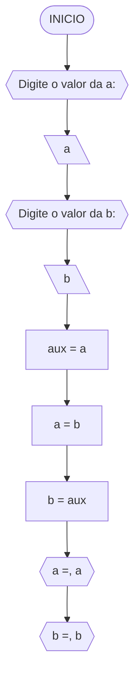

Curso: analise e desenvolvimento de sistema
Disciplina: raciocinio logico
Código/Turma:T160-80
Professor: Ricardo Carubbi
Data: 21/04/24
Aluno(a):marjorie castelo dos santos
Matrícula: preencha com seus dados

1a chamada (Sim/Não): sim
2a chamada (Sim/Não):nao

Questão 1 - Troca dos valores de duas variáveis (1 ponto)

pseudocodico


1.algoritmo definir_variaveis{Definir variáveis a e b}
2.definir_variaveis --> atribuir_valores{Atribuir valores iniciais a e b}
3. atribuir_valores --> guardar_original{Guardar valor original de a em auxiliar}
4.guardar_original --> atribuir_a{Atribuir valor original de b a a}
5. atribuir_a --> atribuir_b{Atribuir valor original de a (guardado em auxiliar) a b}
6.  ALGORITIMO atribuir_b --> mostrar_novos_valores((Exibir novos valores de a e b))
7. FIM_SE
8. FIM


teste de mesa 

Teste de mesa referente ao algoritmo usando o loop PARA.

| it | n  | cont | i  | nota, i | nota | nota_valida | cont+1 | saída   
     
| -- | -- | --   | -- | --      | --   | --   | --    | --    |  --         |
| 1  | 3  | 0    | 1  | nota 1  | 60   | True        | 1      |              |
| 2  | 3  | 1    | 2  | nota 2  | 40   | False       | 1      |              |
| 3  | 3  | 1    | 3  | nota 3  | 90   | True        | 2      | Aprovados: 2 |


Questão 2 - Contagem (1 ponto)

```mermaid

flowchart TD
A([INICIO]) --> B{{Digite o número de alunos: }}
B --> C[\n\]
C --> D[\cont = 0\]
D --> E[\i = 1\]
E --> F{i <= n}
F --FALSE--> W{{Número de alunos aprovados: cont}}
W --> Z([FIM])
F --TRUE--> G{{Digite a nota do aluno, i}}
G --> H[\nota\]
H --> I{"nota >= 50 <br>E <br>nota <=100"}
I --TRUE--> J[\cont =+ 1\]
I --FALSE--> K[\i =+ 1\]
J --> K
K --LOOP--> F


###teste de mesa2

   | isto| n  | i  | continuação | i<=n  | nota, i | nota | nota_valida | cont+1 | i+1 | saída | 
| -- | -- | -- | --   | --    | --      | --   | --          | --     | --  | --           |
| 1  | 3  | 1  |  0   | True  | nota 1  | 60   | True        | 1      | 2   |              |
| 2  | 3  | 2  |  1   | True  | nota 2  | 40   | False       | 1      | 3   |              |
| 3  | 3  | 3  |  1   | True  | nota 3  | 90   | True        | 2      | 4   |              |
| 4  | 3  | 4  |  2   | False |         |      |             |        |     | Aprovados: 2 |


questao3) Soma de um conjunto de números

``` mermaid

flowchart TD
A([INICIO]) --> B{{"Digite a quantidade de números<br> (n >= 0):"}}
B --> C[\n\]
C --> D{n >= 0}
D --FALSE-->N{{"O valor deve ser maior ou igual a zero!"}}
N --> M([FIM])
D --TRUE--> E[/soma = 0/]
E --> F[i = 1]
F --> G{i <= n}
G --FALSE--> L{{"A soma dos numeros é , soma"}}
L --> M
G --TRUE--> H{{Digite um número: }}
H --> I[\num\]
I --> J[soma =+ num]
J --> K[i =+ 1]
K --LOOP--> G


###teste de mesa3

| it | n  | n >= 0 | soma | i  | i <= n | num | soma =+ num  | saída                   |
| -- | -- | --     | --   | -- | --     | --  | --           | --                      |
|    | -3 | False  |      |    |        |     |              | O valor deve ser ...    |
| 1  | 0  | True   | 0    | 1  | False  |     |              | A soma dos números é 0  |
| 1  | 3  | True   | 0    | 1  | True   | 5   | 0 + 5 = 5    |                         |
| 2  | 3  | True   | 5    | 2  | True   | 10  | 5 + 10 = 15  |                         |
| 3  | 3  | True   | 15   | 3  | True   | 20  | 15 + 20 = 35 |                         |
| 4  | 3  | True   | 35   | 4  | False  |     |              | A soma dos números é 35 |

questaon 4 -Cálculo de um serie

```mermaid

flowchart TD

A([INICIO]) --> B{{Digite o número de termos da série S: }}
B --> C[/n/]
C --> D[S = 0]
D --> E[[i=0 ATE n PASSO 1]]
E --i > n--> J{{"Soma da série S é ", S}}
J --> K([FIM])
E --"i=0,1,2,..,n"--> F[numerador = 2 * i + 1]
F --> G[denominador = 2 * i + 2]
G --> H[termo = numerador / denominador]
H --> I[S += termo]
I --LOOP--> E


Questão 5 - Cálculo fatorial 

```mermaid

flowchart TD
A([INICIO]) --> B{{"Digite um numero inteiro nao-negativo:"}}
B --> C[/n/]
C --> D{n >= 0}
D --TRUE--> E[fator = 1]
D --FALSE--> J{{O valor deve ser maior ou igual a zero!}}
J --> I([FIM])
E --> F[[i=1 ATÉ n PASSO 1]]
F --"i > n"--> H{{O fatorial de, n, é:, fator}}

teste de mesa 5 
|N|fator| i | fator = fator * i| saida|
|  --  |  --  |  --  |  --  |  --  |  --             |
| 3  | 1     | 1  | 1*1 = 1    |                     |
| 3  | 1     | 2  | 1*2 = 2    |                     |
| 3  | 2     | 3  | 2*3 = 6    | O fatorial de 3 é 6 |

Questão 6 - Geração da sequência de Fibonacci

```mermaid

flowchart TD
A([INICIO]) --> B([FIM])
A([INICIO]) --> B{{"Número de termos da série Fibonacci:"}}
B --> C[a = 0]
C --> D[b = 1]
D --> E[[i=1 ATÉ n PASSO 1]]
E --"i > n"--> J([FIM])
E --"i=1,2,...,n"--> F{{a}}
F --> G[termo_atual = a + b]
G --> H[a = b]
H --> I[b = termo_atual]
I --LOOP--> E

